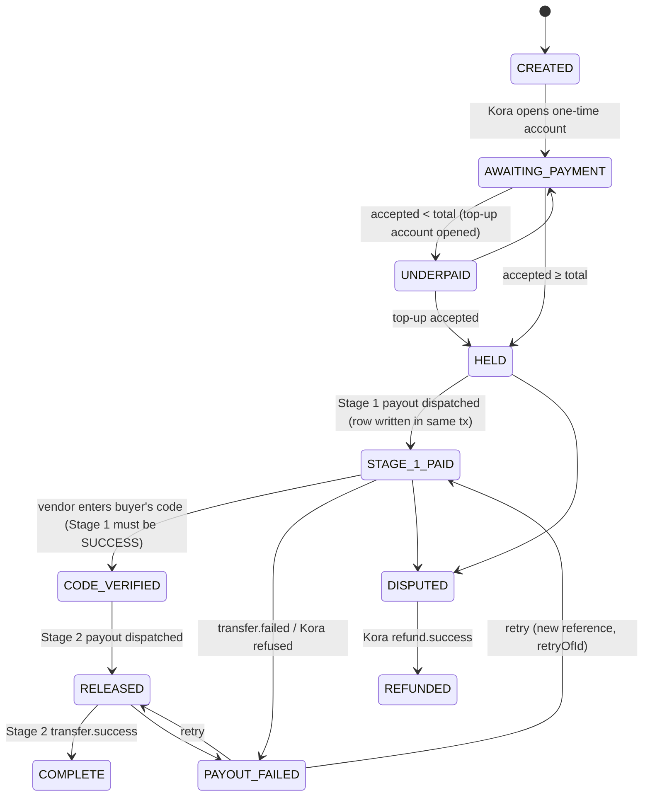
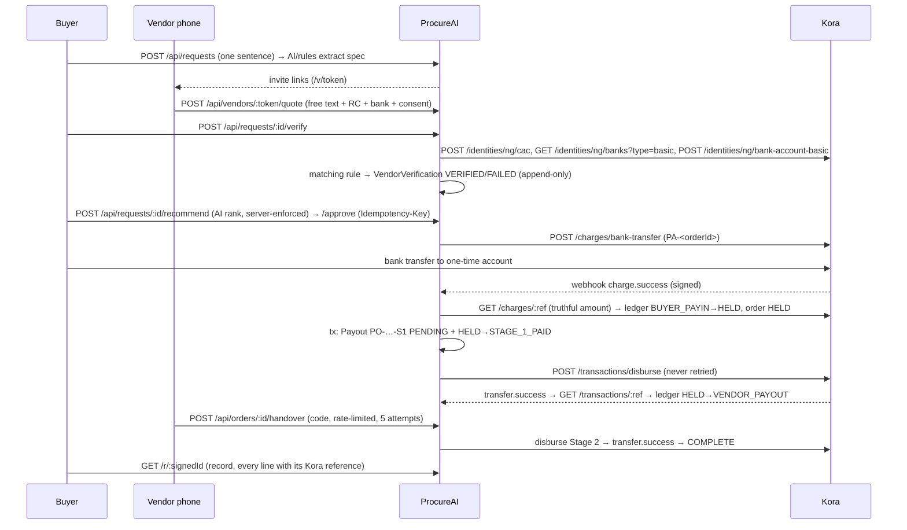

# Architecture

## The webhook path in 5 lines
1. `POST /api/webhooks/kora` reads the **raw** body, verifies `x-korapay-signature` (HMAC-SHA256 of the `data` bytes, constant-time), and **always answers 200**.
2. Every delivery is stored in `KoraEvent` (invalid signatures too); dedupe on (type, reference, sha256(verdict + raw data)) makes replays no-ops.
3. Valid, new events get an `Outbox` row; a worker claims rows with `FOR UPDATE SKIP LOCKED`, retries with exponential backoff + jitter, parks after 5.
4. Processing never trusts the webhook's amount: it **re-queries Kora** (`GET /charges/:ref`, `GET /transactions/:ref`) and applies the answer under `SELECT … FOR UPDATE` on the order.
5. The poller and the Re-check button call the **same** reconcile functions, so webhook, poller and user converge on one state change.

## Order state machine

The table lives in `lib/domain/state.ts` and is mirrored in the `OrderTransitionRule` table; a DB trigger rejects any other
move **and** any move without an `OrderTransition` audit row written in the same transaction (`txid_current()`). A test asserts
the two tables are equal.

## Sequence — one purchase

## Invariants (enforced in Postgres)
| | Rule | Mechanism |
|---|---|---|
| I1 | Payouts/orders only for a vendor whose **latest** verification is VERIFIED; payouts only to the verified account (or, test key only, Kora's documented sandbox accounts) | triggers `I1_order_verified`, `I1_I3_payout_insert`; CHECK `I1_sandbox_route_accounts` |
| I2 | Unique payout reference; one live payout per (order, stage) | UNIQUE + partial unique index `WHERE status <> 'FAILED'` |
| I3 | Live payouts ≤ accepted amount | trigger under the order row lock; accepted can't drop below committed |
| I4 | Verified bank details and payout destinations immutable | triggers on Vendor, VendorVerification (append-only), Payout |
| I5 | Legal transitions only, each audited in the same tx | `I5_order_status_guard` + rule table |
| I6 | Webhook dedupe; received content immutable | UNIQUE (type, reference, idempotencyHash); `I6_kora_event_immutable` |
| I7 | BIGINT kobo, positive where money moves | column types + CHECKs; source scan test for float maths |
| I8 | Kora-derived rows keep reference + raw response | CHECKs on verification/payout/refund/pay-in |
| Ledger | Balanced per order at commit; HELD never negative | deferred constraint trigger + immediate floor trigger |

## Concurrency
Reads from Kora happen **outside** DB locks; applying an answer happens **inside** `lockOrder()` and is idempotent and monotonic
(a PayIn/Payout leaves its pending state exactly once). Tests fire webhook + poller + two Re-checks at once and assert one
transition, one credit, one payout, one Kora disburse call.

## Realtime
Timeline rows fire `pg_notify`; one LISTEN connection per process fans out to SSE streams. Each SSE message is a full snapshot
tagged with the newest timeline id, so EventSource's automatic reconnect always backfills. No client polling.
